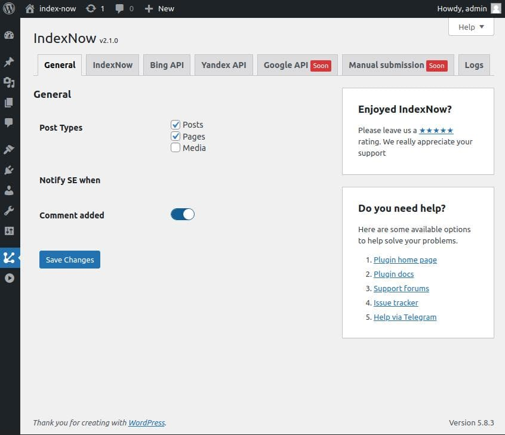
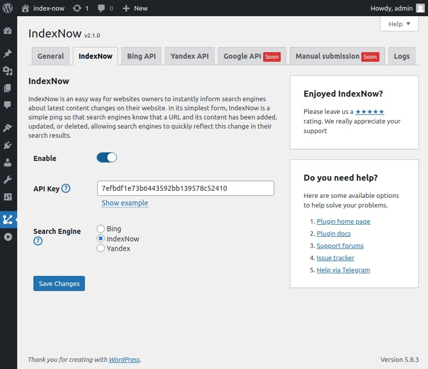
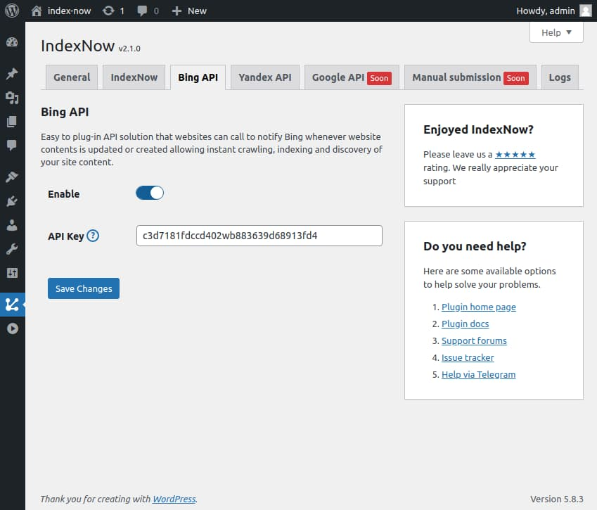
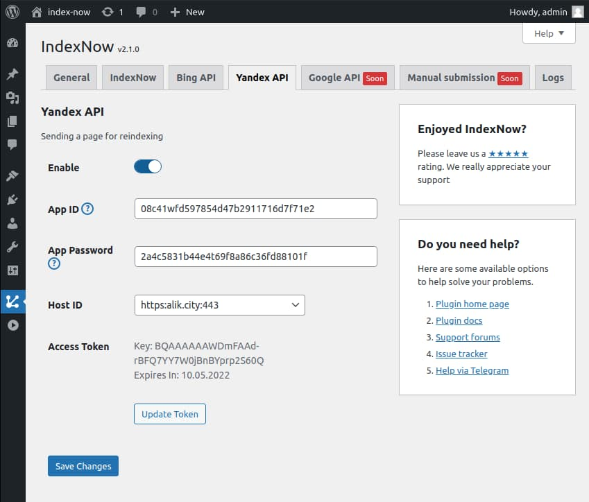
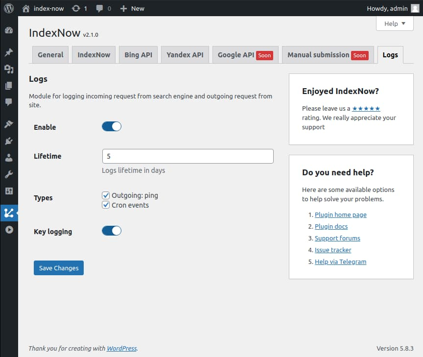
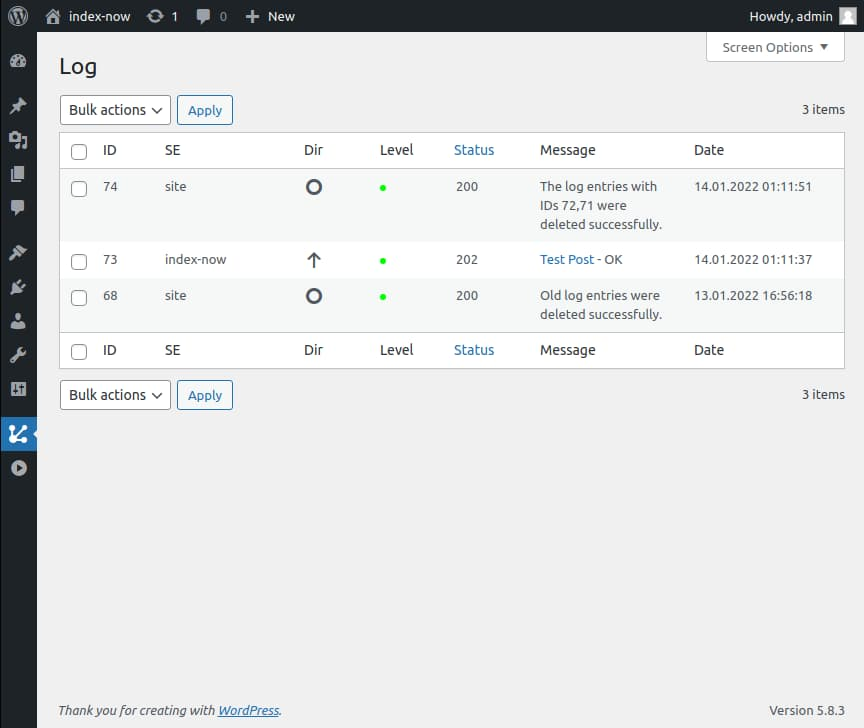

# 🤖  IndexNow

IndexNow is a small WordPress Plugin for quickly notifying search engines whenever their website content is created, updated, or deleted.

Improve your rankings by taking control of the crawling and indexing process, so search engines know what to focus on!

Once installed, it detects pages/terms creation/update/deletion in WordPress and automatically submits the URLs in the background via IndexNow, Google API, Bing API, and Yandex API protocols.

It ensures that search engines invariably have the latest updates about your site.

## Screenshots

